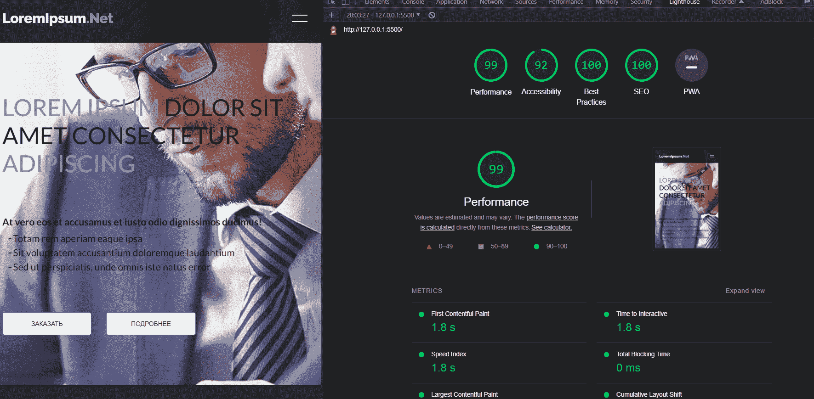

## LOREMIPSUM.NET

<div align="left">


#
<h2>Сайт доступен для людей с ограниченными возможностями. Оптимизирован для загрузки и SEO</h2>



#
## Проект сожержит
<details>
  <summary>SCSS</summary>
 
  [Что это?](https://sass-scss.ru/)  

    Вы можете изменять  настройки в вашем проекте. 
    Для  автоматического комполирования файлов css необходимо запустить 

  Live Sass Compiler 

  [Что это?](https://marketplace.visualstudio.com/items?itemName=ritwickdey.live-sass)  

    В проекте scss создает 2 css файла style-light style-dark 
    для разных цветовых тем.

    Конфигурации нужно изменять в файлах variables_light.scss variables_dark.scss 
</details>

<details>
  <summary>Swiper слайдер</summary>
 
  [Что это?](https://swiperjs.com/) 
 
    Превосходный слайдер заточенный строго для работы с мобильными сайтами или веб приложениями.
</details>

<details>
  <summary>Доступность для людей с ограниченными возможностями</summary>
 
  [Что это?](https://tproger.ru/articles/chto-takoe-dostupnost-sajta-i-kak-ejo-proverit/) 

    Для перемещения по сайту используйте  клавиши shift и tab.

    Доступность означает, что сайт разработан таким образом, что им могут пользоваться люди с ограниченными возможностями. Под использованием понимается восприятие информации, навигация по интерфейсу и взаимодействие с ним.

    Основные характеристики доступности:

    контраст цветов;
    распознавание голоса;
    поддержка скринридеров — озвучивание сайта для слепых и слабовидящих людей;
    логичная и простая навигация;
</details>
<details>
  <summary>Семантическую вёрстку</summary>
 
  [Что это?](https://htmlacademy.ru/blog/articles/semantics) 

     Подход к разметке, который опирается не на содержание сайта, а на смысловое предназначение каждого блока и логическую структуру документа. Даже в этой статье есть заголовки разных уровней — это помогает читателю выстроить в голове структуру документа. Так и на странице сайта — только читатели будут немного другими.
</details>
<details>
  <summary>Локальный сервер</summary>
 
  [Что это?](https://ru.wikipedia.org/wiki/Localhost) 
 
    По умолчанию [localhost:8080](http://localhost:8080).
</details>


# 
## Для запуска потребуется
- этот репозиторий 
 ```
git clone https://github.com/VladislavBobyrev/https://github.com/VladislavBobyrev/loremipsum.net
```

- Live Sass Compiler

 
```
https://marketplace.visualstudio.com/items?itemName=ritwickdey.live-sass
```

- браузер


 
#
## Связвться со мной
<div align='center'> 
 
 ```
vladislavbobyrev@yandex.ru
```
 
 [](https://t.me/VladislavBobyrev)

 </div>
 
<div align="center">
  <h2>**ВНИМАНИЕ!**  Вся конфигурация является открытой. </h2>
 
</div>
